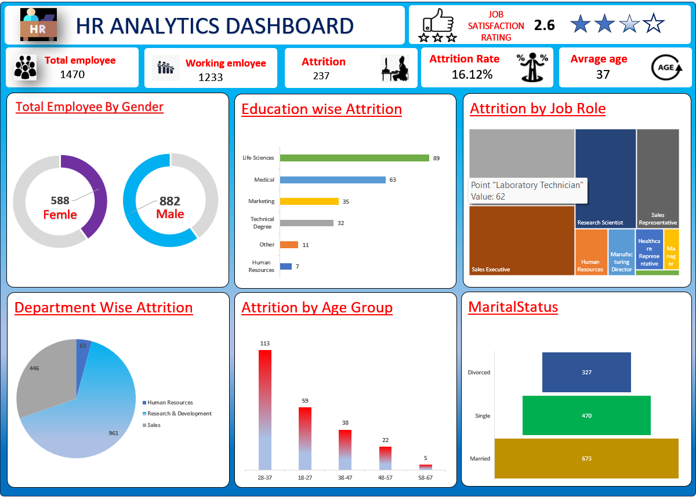

# HR-Analytics-Excel-Dashboard
HR Analytics Dashboard created using Microsoft Excel with Attrition Analysis
📌 Project Overview

This project presents an HR Analytics Dashboard built using Microsoft Excel to analyze employee attrition and workforce trends. The dashboard provides meaningful insights to support data-driven HR decisions.

🔍 Key Insights
Total Employees: 1470            
Attrition Count: 237           
Attrition Rate: 16.12%              
Average Age: 37           
Department-wise Attrition Analysis            
Education-wise Attrition Analysis              
Job Role-based Attrition Insights              
Age Group and Marital Status Analysis              

🛠 Tools Used
Microsoft Excel
Pivot Tables
Charts & Graphs
Data Cleaning
Dashboard Design

📷 Dashboard Preview

  

🚀 Skills Demonstrated

HR Data Analysis
Business Insights Extraction
Data Visualization
Analytical Thinking
